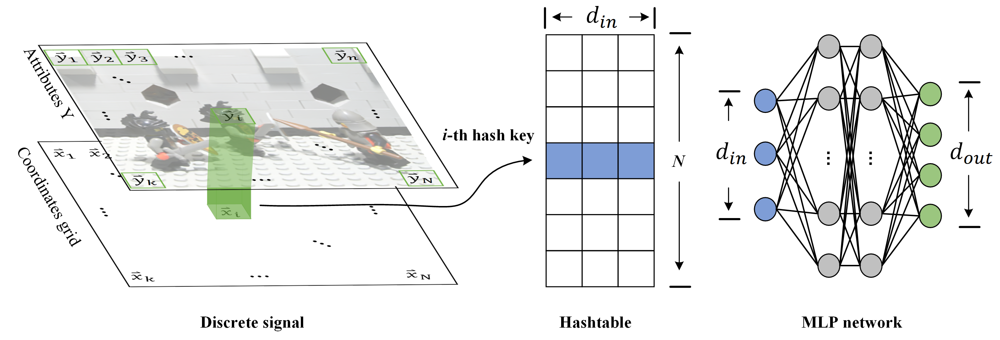

# DINER: Disorder-Invariant Implicit Neural Representation 

PyTorch implementation of DINER.

## Pipeline



## Setup
We provide a conda environment setup file including all of the above dependencies. Create the conda environment DINER by running:
```
conda create -n diner python=3.9
conda activate diner
pip install -r requirements.txt
```
 
## Training

#### Image Representation
For tasks like fitting a single image, we prepare a test image in the `data` folder. 

To train image representations, use the config files in the `config` folder. For example, to train on the provided image, run the following
```
python train_img.py --config ./config/img.ini
```

After the image representation has been trained, the results of the image will appear in the `log/<experiment_name>` folder, where `<experiment_name>` is the subdirectory in the `log` folder corresponding to the particular training run.


## Citation

```
@article{xie2022diner,
    title={DINER: Disorder-Invariant Implicit Neural Representation},
    author={Xie, Shaowen and Zhu, Hao and Liu, Zhen and Zhang, Qi and Zhou, You and Cao, Xun and Ma, Zhan},
    journal={arXiv preprint arXiv:2211.07871},
    year={2022}
}
```